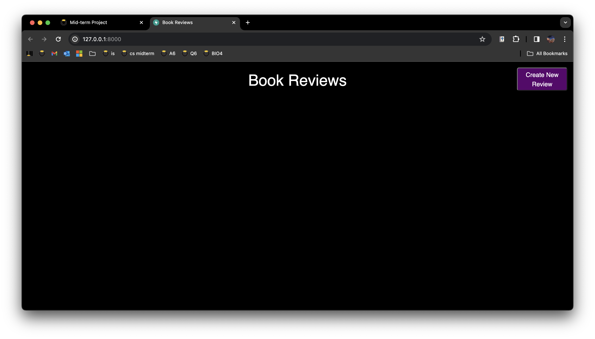
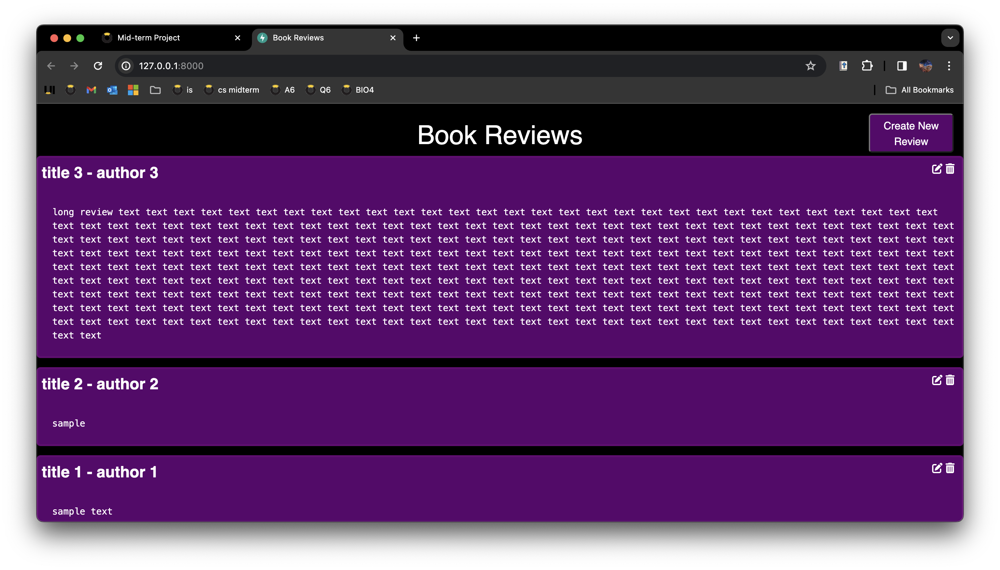
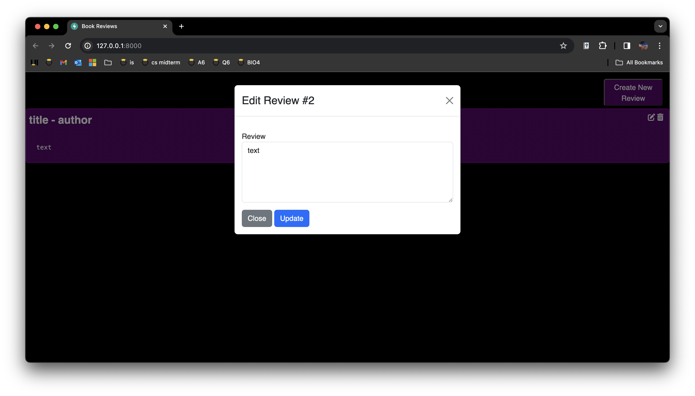

# MIDTERM3980

This repository is for the midterm assinment for cs:3980. It includes a program with a Python backend that starts an app using html, css, and JavaScript as a frontend. The first image bleow shows the start page of the site. The second shows the form for filling out a review. The third image shows the site with several reviews. The fourth image shows the form for editing a reveiw.

